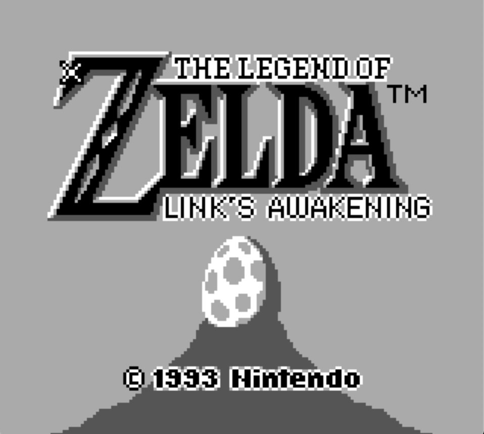

# GBRuby

GBRuby is another Game Boy emulator, written in ruby.
No ambitions to become the better emulator ever, it's just a side project made for fun.
Despite all it aims to run more games as possible at a decent fps and pass all the common tests.

## Why Ruby?

Ruby is slow and not a good choice for an emulator.
The challenge is to write something good enough to play games and check if it is possible to run it at 60 fps (spoiler: yes)

## Screenshots from various games

|  |   |
|--------------------------------------------|--------------------------------|
|    |     |

## Tests

There are no automated tests yet, but GBRuby pass some common tests ROM. I will add more and more.

|  |   |
|--------------------------------------------|-----------------------------------------------------|
| DMG Acid2                                  | Blargg‘s CPU Tests                                  |

## Roadmap

- Boot sequence
- Add automated testing using Github Actions.
- Support to cartridge type other than MBC1.
- Optimizations to reach constant 60 FPS with every game.
- Command line interface.
- Configuration file.
- Sound support.
- Game Boy Color support.

## Requirements

- Ruby 3
- SDL 2

## Install SDL2 on macos

    $ brew install sdl2
    $ brew install sdl2_image
    $ brew install sdl2_mixer
    $ brew install sdl2_ttf

## How to use it?

Initialize the Game Boy, choose a cartridge, load it, and play!

    $ game_boy = GameBoy.new
    $ cartridge = Cartridge.new('roms/tetris.gb')
    $ game_boy.load_cartridge(cartridge)
    $ game_boy.play(boot: false)

## Resources

- [Pan Docs](https://gbdev.io/pandocs/About.html)
- [Game Boy development WIKI](https://gbdev.gg8.se/wiki/articles/Main_Page)
- [codeslinger.co.uk](http://www.codeslinger.co.uk/pages/projects/gameboy/beginning.html)
- [The Ultimate Game Boy Talk (33c3)](https://www.youtube.com/watch?v=HyzD8pNlpwI&ab_channel=media.ccc.de)

## Similar and inspirational ruby projects

- [Optcarrot, a NES emulator in ruby](https://github.com/mame/optcarrot)
- [Waterfoul, a Game Boy emulator in ruby](https://github.com/colby-swandale/waterfoul)
